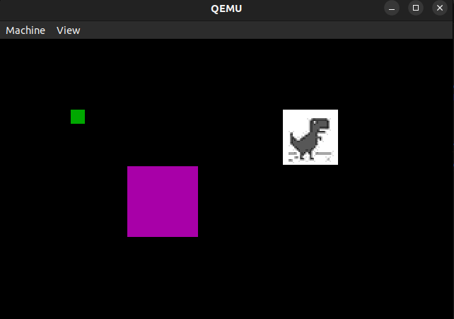

# Some 16-bit thing

### What is it?

It is some 16-bit x86 NASM-syntax code written by me to learn more about assembly whilst having fun. I was having so much fun I forgot about transitioning to 32-bit mode, but then realized I don't care because I can do that later :)

### What can it do?

It can display some boxes and images. Due to the limitations of the BIOS 10h interrupt functions and the video mode I'm using, I can't display RGB pixels (only some color codes). So, I wrote some unsafe C programs in the `util` directory to help with transitioning RGB to the BIOS color codes.